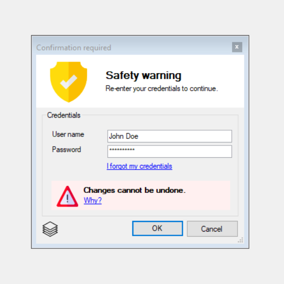
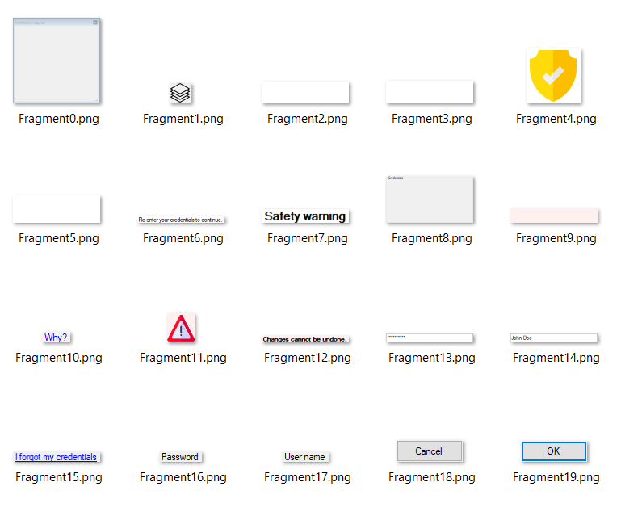
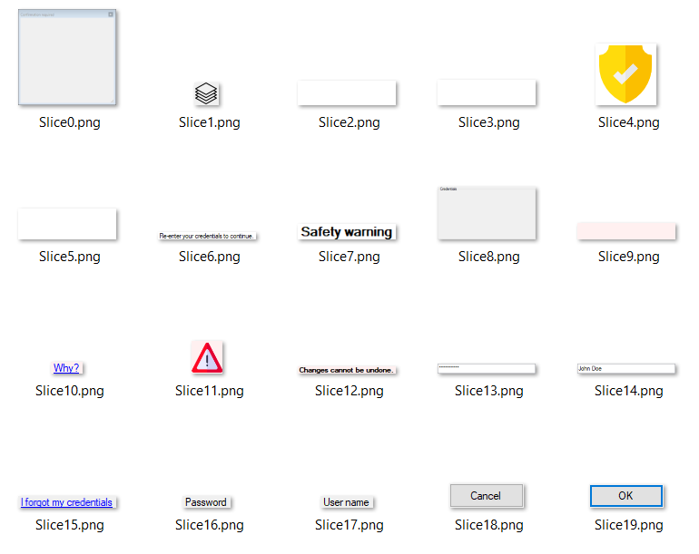

# WinFormsCT

### A new way to analyse the anatomy of a WinForms form.

#### WinFormsCT is able to scan any form (`System.Windows.Forms.Form`) by traversing through all child controls recursively.
* Out of a form like this ...

* ... WinFormsCT will detect each control, save a screen copy and collect additional meta data:

* With that, WinFormsCT is able to reconstruct a kind of "height map" for the all the controls of the same hierarchy levels and renders them into "slices" like any good computer tomographer would do.

* These slices can then be used to browse the form's control hierarchy interactively. Including some awesome effects with good old GDI+.

Why? Because I can. 
