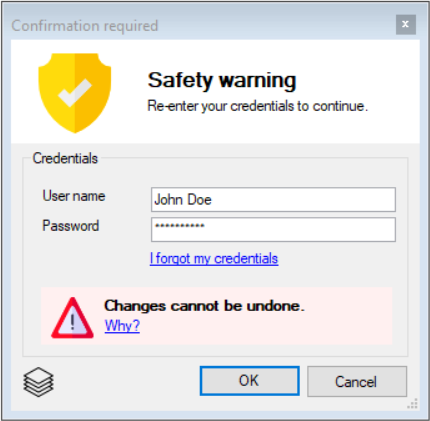
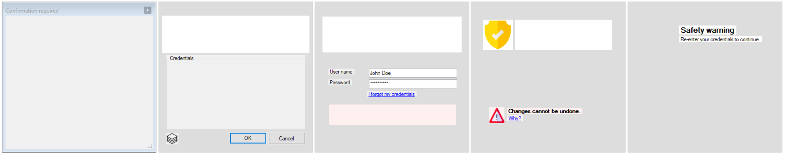

# WinFormsCT

### A new way to analyse the anatomy of a WinForms UI.

#### WinFormsCT will scan any form (`System.Windows.Forms.Form`) and all of its child controls recursively to generate a sliced-based height map.
* Out of a form like this ...

* ... WinFormsCT will detect each control, save a screen copy and collect additional meta data:

* With that, WinFormsCT is able to reconstruct a kind of "height map" for the all the controls of the same hierarchy levels and renders them into "slices" like any good computer tomographer would do.

* These slices can then be used to browse the form's control hierarchy interactively. Including some awesome effects with good old GDI+.

Why? Because I can. 

## Credits
The app icon was made by <a href="http://www.freepik.com" title="Freepik">Freepik</a> from <a href="https://www.flaticon.com/" title="Flaticon">www.flaticon.com</a> and is licensed by <a href="http://creativecommons.org/licenses/by/3.0/" title="Creative Commons BY 3.0" target="_blank">CC 3.0 BY</a>